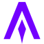

  
  

 
 

  
  &nbsp;
  
  &nbsp;
  
  &nbsp;
  
  &nbsp;
  
  &nbsp;
  
  &nbsp;
  

*(yes, I use Arch btw)*

- &nbsp;<a href="https://x.com/simonkovtyk" target="_blank">@simonkovtyk</a>
- &nbsp;<a href="https://simonkov.dev/" target="_blank">My Portfolio</a>
- &nbsp;<a href="mailto:simon@kovtyk.dev" target="_blank">simon@kovtyk.com</a>
